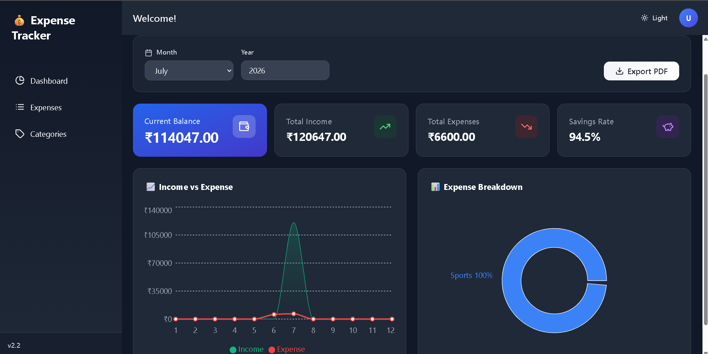
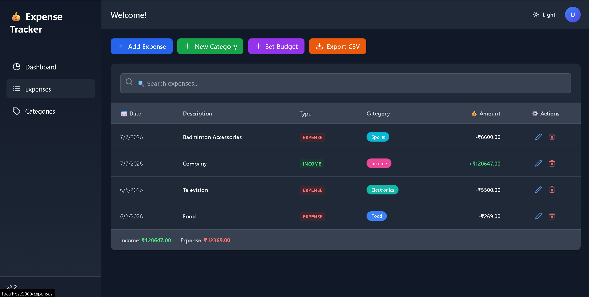
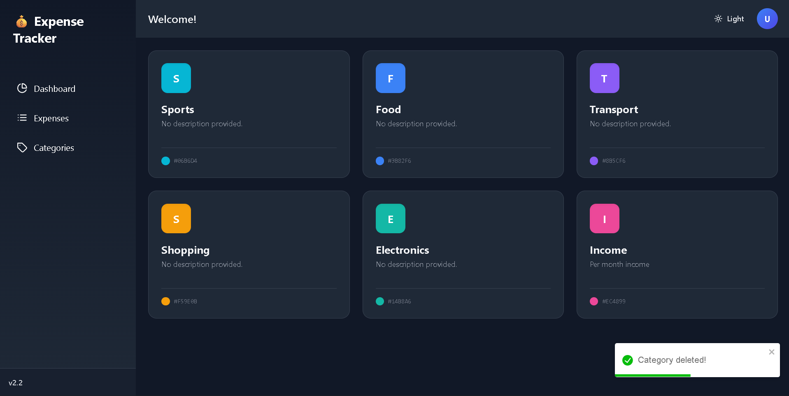

# 💸 Expense Tracker

<p align="center">
  


</p>

> A modern full-stack personal finance management application built with
> **React**, **FastAPI**, **SQLAlchemy**, and **PostgreSQL/SQLite**.
> Track income and expenses, manage category budgets, visualize
> financial insights, and export reports in PDF and CSV formats through
> A clean dashboard.

------------------------------------------------------------------------

## 🌐 Live Demo

🔗 ___Upcoming Soon___

------------------------------------------------------------------------

## 📸 Screenshots

### Dashboard



### Expenses



### Categories



------------------------------------------------------------------------

## ✨ Features

-   Income & Expense Tracking
-   Dashboard with financial summary cards
-   Interactive analytics using Recharts
-   Category management
-   Monthly budget monitoring
-   Budget alerts
-   PDF report export
-   CSV export
-   Responsive UI
-   Dark / Light theme
-   FastAPI REST API
-   Docker-ready development setup

------------------------------------------------------------------------

## 🛠 Tech Stack

### Frontend

-   React 18
-   Tailwind CSS
-   Recharts
-   React Router
-   Lucide React
-   React Toastify
-   jsPDF
-   html2canvas

### Backend

-   FastAPI
-   SQLAlchemy
-   PostgreSQL / SQLite

### Tools

-   Docker
-   Git
-   GitHub

------------------------------------------------------------------------

## 🚀 Installation

### Prerequisites

-   Node.js 16+
-   Python 3.9+
-   Docker (optional)

### Quick Start

``` powershell
.\start-dev.ps1
```

### Manual Setup

#### Backend

``` bash
cd backend
python -m venv venv
venv\Scripts\activate
pip install -r requirements.txt
python main.py
```

#### Frontend

``` bash
cd frontend
npm install
npm start
```

------------------------------------------------------------------------

## 🏗 Project Structure

``` text
Expense_Tracker/
├── backend/
├── frontend/
├── screenshots/
├── .gitignore/
├── docker-compose.yml
└── LICENSE
├── package-lock.json
├── package.json
├── README.md
├── start-dev.ps1
```

------------------------------------------------------------------------

## 📊 Dashboard & Analytics

-   Current Balance
-   Total Income
-   Total Expenses
-   Savings Overview
-   Income vs Expense Trend
-   Category Breakdown
-   Budget Progress
-   Recent Transactions

------------------------------------------------------------------------

## 📥 Export Features

-   PDF Dashboard Report
-   CSV Transaction Export

------------------------------------------------------------------------

## 📅 Version History

  Version   Highlights
  --------- -----------------------------------------------
  v2.2      Analytics, PDF Export, Dashboard Improvements
  v2.1      Income Tracking, Enhanced Dashboard
  v2.0      UI/UX Modernization, Animations
  v1.0      Initial Expense Tracking

------------------------------------------------------------------------

## 🛣 Future Roadmap

-   User Authentication
-   Cloud Synchronization
-   Enhanced Budget Insights
-   More Financial Reports

------------------------------------------------------------------------

## ⭐ Support the Project

If you found this project useful:

-   ⭐ Star the repository
-   🍴 Fork the repository
-   🐞 Report bugs
-   💡 Suggest improvements

Your support helps improve the project.

------------------------------------------------------------------------

## 📜 License

Licensed under the **MIT License**.

See the `LICENSE` file for details.

------------------------------------------------------------------------

## ❤️ Built By

**Shashwat Sharma**

Computer Science Engineering Student

GitHub: https://github.com/Shashwatss10

If you found this project helpful, consider giving it a ⭐. 
